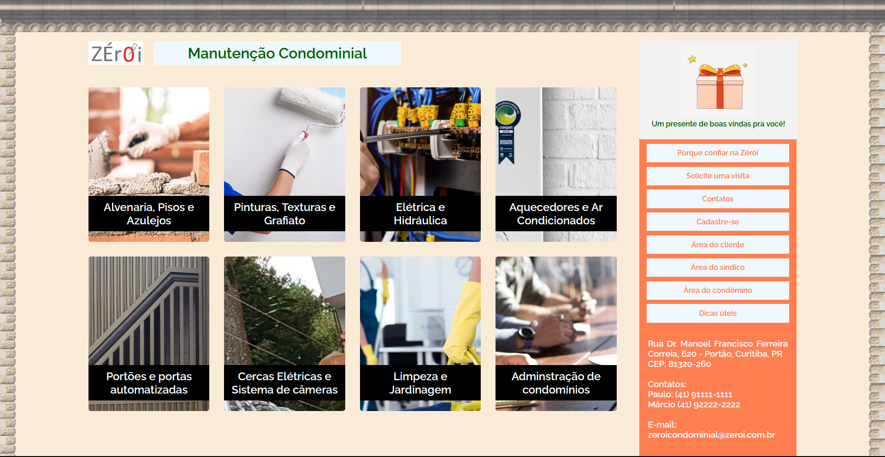

# Projeto Integrador Desenvolvimento Front-End - Zérói

## Descrição Técnica
Este é um site estático feito para o primeiro projeto integrador do meu curso técnico no Senac em 2023, finalizando o módulo de desenvolvimento web front-end. Com a documentação não sendo relevante fora desse contexto.

A ideia veio a partir de um briefing durante as aulas com meu colega Paulo, mas a execução eu fiz sozinho.

Este README foi escrito depois de mais de um ano após a apresentação em sala.

## Página Inicial
